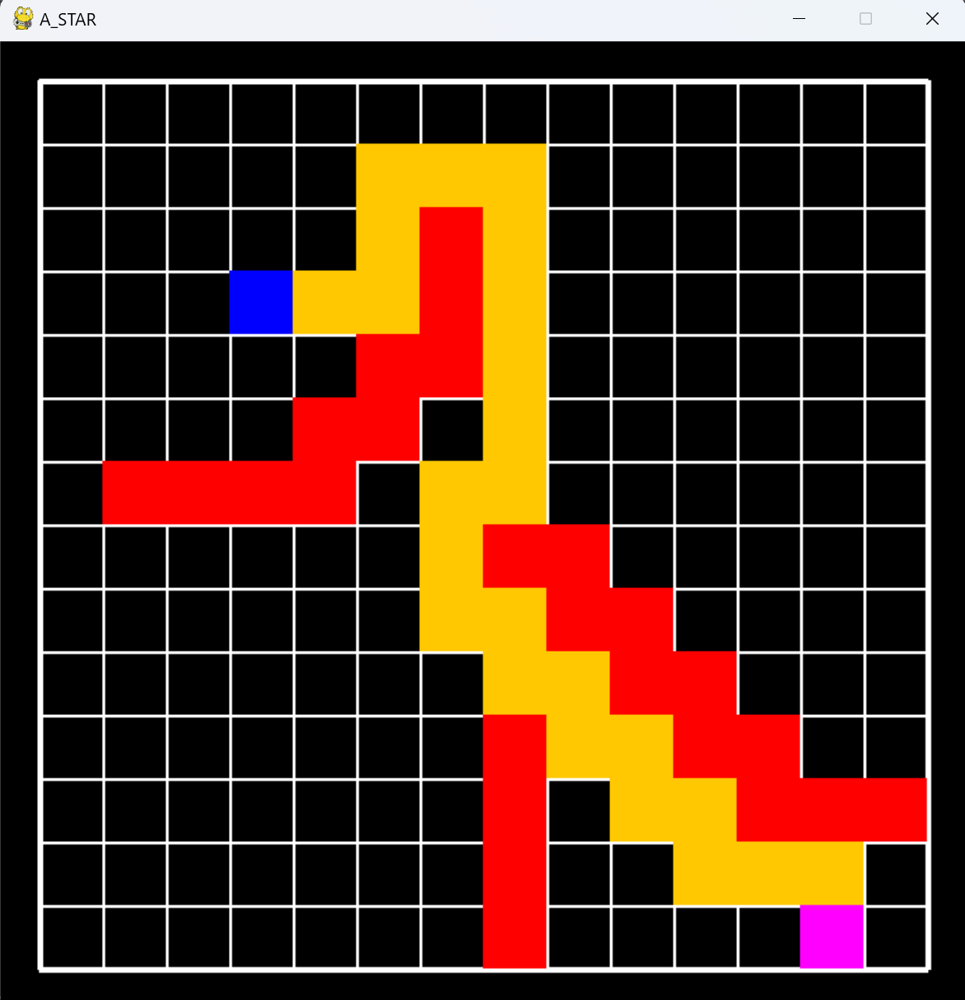

# An A-Star algorithm visualization program
***Author***: Shiwei Liu, [College of Artificial Intelligence, Nankai University](https://aien.nankai.edu.cn/)

***E-mail***: 2011832@mail.nankai.edu.cn
## About this program
This project is one of my assignments for the course "Artificial Intelligence Technology" during my junior year at Nankai University. This program is used to achieve A-Star algorithm which is a typical way to find the shortest path for an agent. I also visulized this algorithm via [pygame](https://www.pygame.org).

## Instructions
1. You need a conda enviroment whose Python version is later than 3.8:
    ```
    conda create -n YOUR_ENV_NAME python==3.9
    conda activate YOUR_ENV_NAME
    ```
2. Just install pygame pkg by running:
    ```
    pip install pygame
    ```
3. Run this command to get started:
   ```
   python A_STAR.py
   ```
4. Click the left mouse button to set the starting point, middle mouse button to set obstacles, and right mouse button to set the target point:
   
    Items    | Stand for
    -------- | -----
    Blue  | Start position
    Purple  | Goal position
    Yellow  | Path by A-Star
    Red  | Obstacles

